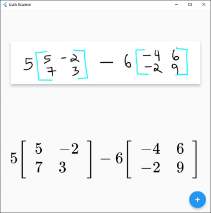
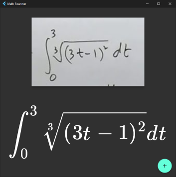

# Math Scanner

The Math Scanner app is a simple application that allows users to take a screenshot, extract mathematical expressions from the screenshot using OCR (Optical Character Recognition), and render them as LaTeX equations. It uses an external API for mathematical expression recognition. The app supports dark theme and automatically adapts to the system settings.

## Screenshots

## Download

### Setup for Windows

### Portable for Windows

### Portable for Linux
> Requires `gnome-screenshot`

## Usage

1. Launch the Math Scanner app on your device.

2. You will see a message prompting you to click the FAB (floating action button) to take a screenshot.

3. Click the FAB to capture a screenshot.

4. The app will process the screenshot and try to recognize mathematical expressions using an external OCR API.

5. If successful, the recognized result will be displayed as a rendered LaTeX equation on the screen.

6. If the recognition fails, the app will display an error message indicating that it couldn't find any formulas.

7. If OCR text is recognized instead of a LaTeX equation, the text will be displayed on the screen.

8. The recognized result will also be copied to the clipboard automatically.

## Important Note

The Math Scanner app uses an undocumented API hosted at 'https://mathsolver.microsoft.com/cameraexp/api/v1/getlatex' for mathematical expression recognition. This API is not officially documented by Microsoft. Therefore, it may be subject to change or discontinuation without notice.

**Use at your own risk**: The usage of undocumented APIs is generally discouraged, as it may violate the terms of service of the provider and could lead to unintended consequences.

## Contributing

Contributions to the Math Scanner app are welcome! If you encounter any issues or have suggestions for improvements, please feel free to open an issue or submit a pull request.
